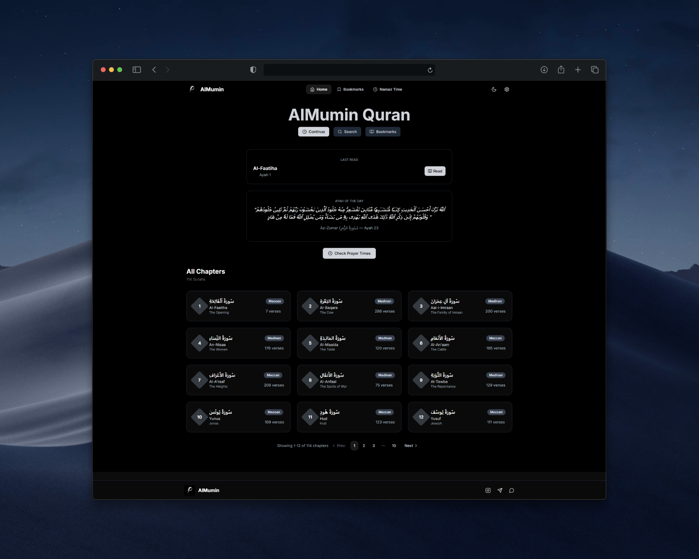
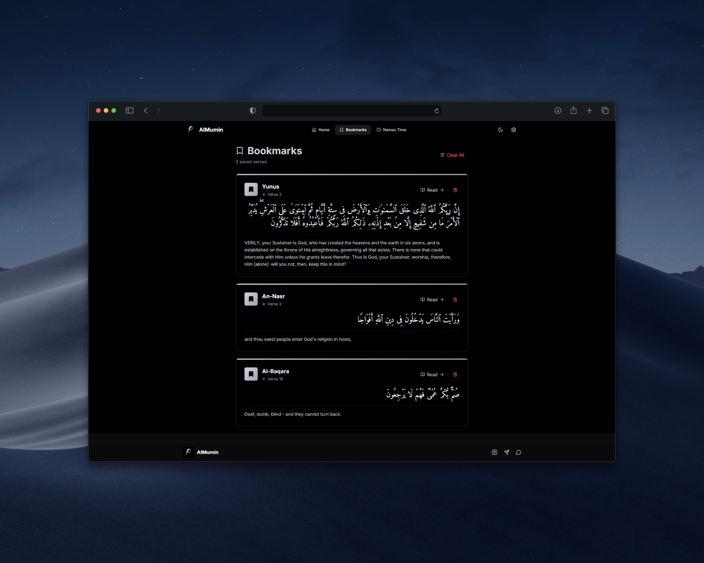
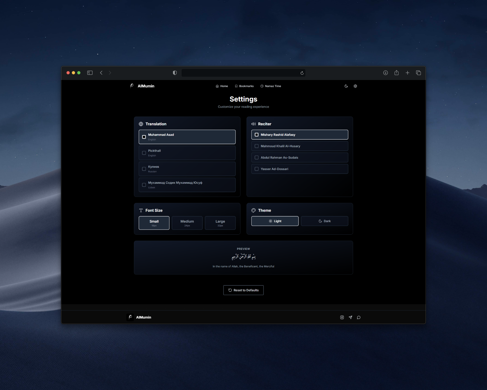

<div align="center">

# 🌙 AlMumin  
### *"Indeed, the believers have succeeded." — Al-Mu'minun (23:1)*  

🕌 A modern website for reading, listening, and studying the Quran.  
Built with attention to clean interface, smooth UX, and respect for the meaning of the Holy Scripture.

---

[](https://react.dev/)
[](https://tailwindcss.com/)
[](https://www.framer.com/motion/)
[](https://vitejs.dev/)
[](LICENSE)

---

### 🌐 Live Preview  
🔗 [Open Website →](https://quran.mumin.ink)

</div>

---

## ✨ Features

### 📖 Reading and Studying
- ✅ Full Quran text (114 surahs)
- ✅ Translations in multiple languages (configurable in settings)
- ✅ Arabic text transliteration
- ✅ Font size adjustment with **live preview**
- ✅ Smooth navigation between ayahs

### 🎧 Listening
- ✅ Listen to surahs with **reciter selection**
- ✅ Continue from **last read ayah**
- ✅ **"Read"** button with auto-scroll to the right place
- ✅ Audio player with playback controls

### 🔖 Bookmarks and History
- ✅ Save favorite ayahs to **bookmarks**
- ✅ "Read" button in bookmarks → instant auto-scroll
- ✅ Copy ayah with **direct link** for quick access
- ✅ Easy management of saved ayahs

### 🔍 Search
- ✅ Search surahs by name
- ✅ Quick jump to found surah
- ✅ Real-time filtering

### 🕊 Additional Features
- ✅ **Ayah of the Day** — random inspiring ayah on each visit
- ✅ Responsive design for all devices
- ✅ Smooth animations and transitions
- ✅ Minimalist and respectful interface

---

## 🛠️ Technologies

| Technology | Purpose |
|-------------|-------------|
| ⚛️ **React 18** | Modern UI framework with hooks |
| 💨 **Tailwind CSS** | Utility-first CSS for rapid styling |
| 🎞 **Framer Motion** | Advanced animations and micro-interactions |
| 🌐 **Quran API** | RESTful API for text, translations, and audio |
| ⚡ **Vite** | Lightning-fast build and HMR |
| 🎨 **Lucide React** | Modern SVG icons |

---

## 🧩 Project Structure

```
📁 almumin/
├── 📁 favicon/                      # 🧩 Icons and metadata for different devices
│
├── 📁 public/
│   ├── 📁 transliterations/         # 🔤 Transliterations of all 114 surahs (JSON)
│   │   ├── 1.json
│   │   ├── 2.json
│   │   ├── ...
│   │   └── 114.json
│   └── 🖼️ logo.png                  # Project logo
│
├── 📁 src/
│   ├── 📁 components/               # ⚛️ Main React components
│   │   ├── AudioPlayer.tsx          # 🎧 Audio player for surah recitation
│   │   ├── AyahCard.tsx             # 🕋 Ayah card component
│   │   ├── Bookmarks.tsx            # 🔖 Bookmarks page
│   │   ├── Dashboard.tsx            # 🏠 Main dashboard
│   │   ├── Footer.tsx               # 📜 Footer section
│   │   ├── Navigation.tsx           # 🧭 Navigation and menu
│   │   ├── Pagination.tsx           # 📑 Pagination component
│   │   ├── Settings.tsx             # ⚙️ Interface and reading settings
│   │   ├── SurahList.tsx            # 📚 List of surahs
│   │   ├── SurahPage.tsx            # 📖 Specific surah page
│   │   └── SurahSkeleton.tsx        # ⌛ Loading skeleton for surahs
│   │
│   ├── 📁 hooks/                    # 🪝 Custom React hooks
│   │   └── useLocalStorage.js       # 💾 Hook for localStorage operations
│   │
│   ├── 📁 api/                      # 🌐 Quran API integration
│   │   └── quran.ts                 # 🔗 Functions for fetching surahs, ayahs, and translations
│   │
│   ├── 📁 types/                    # 🧩 TypeScript types
│   │   └── quran.ts                 # 🧾 Interfaces for Quran data
│   │
│   ├── App.tsx                      # 🪶 Root application component
│   ├── index.css                    # 🎨 Global Tailwind styles
│   ├── main.tsx                     # 🚀 Application entry point
│   └── vite-env.d.ts                # 🧠 Vite environment types
│
├── 📄 package.json                  # 📦 Project dependencies and scripts
├── 📄 package-lock.json             # 🔒 Locked dependency versions
├── ⚙️ eslint.config.js              # 🧹 Linter configuration
├── 🧩 index.html                    # 🧱 Main HTML template
├── ⚙️ postcss.config.js             # 💅 PostCSS configuration
├── ⚙️ tailwind.config.js            # 🎨 Tailwind CSS configuration
├── ⚙️ vite.config.js                # ⚡ Vite configuration
├── ⚙️ tsconfig.json                 # ⚙️ Common TypeScript settings
├── ⚙️ tsconfig.app.json             # 🧠 TS settings for application
├── ⚙️ tsconfig.node.json            # ⚙️ TS settings for Node environment
├── ⚙️ vercel.json                   # ☁️ Vercel deployment config
├── 📜 LICENSE                       # 📄 MIT License
└── 📘 README.md                     # 🧾 Project documentation

```

---

## 🚀 Installation and Setup

### Prerequisites
- Node.js 16+ and npm/yarn

### Installation Steps

```bash
# 1. Clone the repository
git clone https://github.com/abubakrmuminov/almumin.git
cd almumin

# 2. Install dependencies
npm install
# or
yarn install

# 3. Start dev server
npm run dev
# or
yarn dev

# 4. Open in browser
# Navigate to http://localhost:5173
```

### Production Build

```bash
# Create production build
npm run build

# Preview production build
npm run preview
```

---

## ⚙️ Configuration

### Customization

- **Themes**: Edit `tailwind.config.js` to change color palette
- **API**: Modify endpoints in `src/api/quran.js`
- **Fonts**: Add required fonts in `index.html`

---

## 📱 Roadmap

### Completed ✅
- [x] Reading all 114 Quran surahs  
- [x] Translations in multiple languages (🇷🇺 Russian, 🇺🇿 Uzbek, etc.)  
- [x] Audio listening with reciter selection  
- [x] Bookmarks system  
- [x] Surah search  
- [x] Settings (font, translation, reciter)  
- [x] Ayah of the Day  
- [x] Responsive design  
- [x] 🕌 Prayer times integration *(implemented in separate project)*  
- [x] 🌗 Dark and light themes

---

### In Development 🔄
- [ ] 💫 Enhanced page transitions  
- [ ] 🔊 Audio playback speed control  
- [ ] 📝 Ability to add notes to ayahs  

---

### Planned 📋
- [ ] 🌍 Add more translations (English, Turkish, etc.)  
- [ ] 🎙️ Expanded reciter list  
- [ ] 📊 Reading statistics (time, number of ayahs, etc.)  
- [ ] 🔔 Reading reminders  
- [ ] 📤 Export and import bookmarks
- [ ] 🤲 Collection of duas and selected ayahs  

---

## 🎨 Screenshots

<div align="center">

### Home Page


### Surah Page


### Bookmarks


### Settings


</div>

---

## 🤝 Contributing

Contributions to the project are welcome! Here's how you can help:

1. **Fork** the project
2. Create a **feature branch** (`git checkout -b feature/AmazingFeature`)
3. **Commit** your changes (`git commit -m 'Add some AmazingFeature'`)
4. **Push** to the branch (`git push origin feature/AmazingFeature`)
5. Open a **Pull Request**

### Contribution Guidelines
- Follow existing code style
- Write clear commit messages
- Update documentation when necessary
- Respect Islamic values and ethics in code

---

## 📝 API

The project uses [**Al Quran Cloud API**](https://alquran.cloud/api):

- **Surahs and Ayahs**  
  `https://api.alquran.cloud/v1/surah/{id}`  
  `https://api.alquran.cloud/v1/ayah/{ayahNumber}`  

- **Translations**  
  `https://api.alquran.cloud/v1/ayah/{ayahNumber}/{translation}`  
  Available translation examples:  
  - `ru.kuliev` — E. Kuliev translation  
  - `ru.krachkovsky` — I. Krachkovsky translation  
  - `en.asad` — M. Asad translation  
  - `en.yusufali` — Yusuf Ali translation  

- **Audio (Surah Recitation)**  
  `https://api.alquran.cloud/v1/surah/{id}/{reciter}`  
  Reciter examples:  
  - `ar.alafasy` — Mishary Rashid Al-Afasy  
  - `ar.husary` — Abdul Basit Abdus Samad  
  - `ar.shaatree` — Abu Bakr ash-Shatri  

---

### 💡 API Features
- 🔓 Free, **no API key or authentication required**
- 🧾 Returns data in **JSON** format
- 🌍 Supports **multiple translations** and **recitation variants**
- ⚙️ Convenient for fetching a single surah or the entire Quran

---

## 🐛 Known Issues

- Auto-scroll may lag on some mobile devices
- Audio may not play in Safari without user interaction

Report issues at [Issues](https://github.com/abubakrmuminov/almumin/issues).

---

## 📄 License

MIT License © 2025 — AlMumin Project

See [LICENSE](LICENSE) file for details.

---

## ❤️ Author and Acknowledgments

<div align="center">

**Created with 💚 and respect for the Holy Quran**

### 👨‍💻 Developer  
**Mumin** — Frontend Developer  
💻 React • Tailwind • Motion • UI/UX  
📫 [GitHub](https://github.com/abubakrmuminov)

### 🌿 Special Thanks  
💫 [AlQuran.Cloud](https://alquran.cloud) — for open and reliable **Quran API**  
🌙 [Quran.com](https://quran.com) — for inspiring design and surah presentation structure  
🤲 All Muslims who tested the application  
💙 **React** open-source community for powerful tools  

</div>

---

## 🌟 Support the Project

If you find the project useful:
- ⭐ Star it on GitHub
- 🐛 Report bugs
- 💡 Suggest new features
- 🤲 Mention in dua

---

<div align="center">

### 📖 Quote

*"This is the Book about which there is no doubt,*  
*a guidance for those conscious of Allah."*  
— **Al-Baqarah (2:2)**

---

**Made with the intention to bring believers closer to the words of Allah ﷻ**

[⬆ Back to Top](#-almumin)

</div>